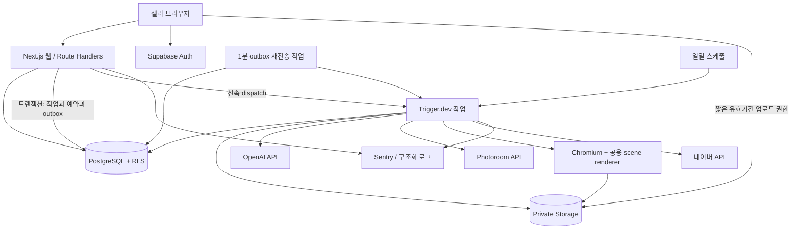
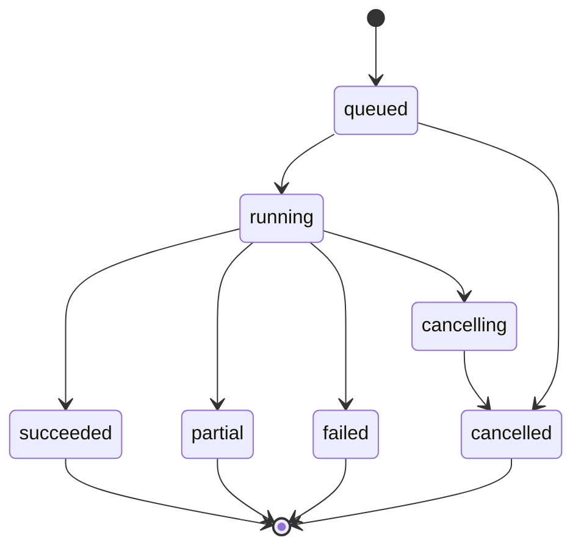

# 기술 설계 — Growth tool MVP

버전 1.0 / 2026-09-17 / [PRD](PRD.md)의 P0 구현 계약. 실제 구현·배포 전 설계이며, 패키지 패치 버전과 공급자 접근권은 T01/T02에서 검증 후 고정한다.

## 1. 확정할 기술스택

| 계층 | 선택 | 책임·선택 이유 |
|---|---|---|
| 언어·런타임 | TypeScript strict, Node.js 22 LTS 호환 런타임, pnpm | 웹·작업·검증 스키마 공유. 배포 런타임 지원을 T01에서 확인 |
| 웹·API | Next.js 16.x App Router, React 19.x | 단일 저장소의 서버 렌더링·인증·Route Handler. 최신 보안 패치 선택 후 lockfile 고정 |
| UI | Tailwind CSS, shadcn/ui, React Hook Form, Zod | 폼·검증·기본 컴포넌트 개발 시간 단축 |
| 캔버스 | Konva + react-konva, Zustand | 제한된 레이어 편집, 실행 취소, 공유 scene 모델 |
| DB·인증 | Supabase PostgreSQL + Auth, SQL migration, supabase-js | PostgreSQL RLS와 이메일 인증. 추가 ORM 없이 DB 타입 생성 |
| 파일 | Supabase Storage private bucket | 제품·배경·결과 파일을 DB 권한과 연결 |
| 비동기 실행 | Trigger.dev Cloud, TypeScript task, schedules | 장시간 AI 호출·재시도·일일 수집, 별도 Redis·Airflow 운영 제거 |
| 비전·카피 | OpenAI Responses API, gpt-4.1-mini-2025-04-14 | 이미지 입력·구조화 출력 가능. 첫 버전 기준 모델, 최신·최고 모델이라는 의미 아님 |
| 배경 생성 | OpenAI Images API, gpt-image-1.5, medium 1024×1024 | 가격 산정 가능한 기준 모델. 제품·글자는 넣지 않은 배경 생성 |
| 제품 누끼 | Photoroom Remove Background API | 별도 GPU 서버 없이 원본 제품 영역 추출, 결과 캐시 |
| 이미지 전처리 | sharp | 크기 제한, 회전 보정, EXIF 제거, 해시·썸네일 |
| 최종 렌더 | Playwright Chromium + 동일 react-konva 렌더러 | 브라우저 편집과 서버 PNG의 폰트·레이아웃 일치 |
| 트렌드 | 네이버 공식 API, 운영자 CRUD | 제한된 소스로 데이터 신뢰성·출처 확보 |
| 배포 | Vercel 웹, Supabase, Trigger.dev | 1인 운영 최소화. 이 문서는 배포 실행 요청이 아님 |
| 관측 | Sentry + DB 구조화 usage/job/event 로그 | 오류·비용·퍼널을 먼저 계측. 외부 제품분석 도구는 이후 추가 |
| 검증·CI | Vitest, Playwright, SQL/RLS 통합 검증, GitHub Actions | 수치·상태·권한·다운로드의 주요 실패 경로 검증 |

Next.js 16은 공식 릴리스·지원 문서, React 캔버스는 Konva 문서를 기준으로 한다. [Next.js](https://nextjs.org/blog/next-16), [지원 정책](https://nextjs.org/support-policy), [React Konva](https://konvajs.org/docs/react/index.html)

모델 기준 사양은 이미지 입력과 구조화 출력을 지원하는 GPT-4.1 mini 공식 문서에 근거한다. 품질 기준을 통과하지 못하면 모델만 교체할 수 있도록 어댑터로 감싼다. [모델 문서](https://developers.openai.com/api/docs/models/gpt-4.1-mini)

### 도입하지 않는 기술

- Airflow: 현재 1개 주 데이터 소스와 몇 개 작업에 별도 Python·스케줄러·메타DB를 운영하지 않는다. 의존 DAG·백필 규모가 커져 운영 필요가 생길 때 재평가한다.
- FastAPI/Celery/Redis/Kafka/Kubernetes: P0의 단일 언어·관리형 작업 구조에 추가하지 않는다.
- LangGraph·자율 멀티에이전트: P0는 고정된 단계와 제한 재시도가 더 감사·복구하기 쉽다. 에이전틱 기능은 기획→생성→검토의 도구 실행으로 구현한다.
- 벡터DB·비전 클러스터링: 소량 레퍼런스에서 검증되지 않은 ‘성공 공식’을 만들지 않는다. 권한 있는 소재와 성과 데이터가 쌓인 뒤 도입한다.
- 자체 누끼/이미지 모델: 모델 라이선스·GPU·품질 운영을 초기 개발에서 제외한다.

## 2. 시스템 경계



웹 요청은 장시간 생성이나 외부 페이지 브라우징을 수행하지 않는다. 작업 접수→202 응답 후 브라우저는 3초 간격으로 상태를 폴링하고 숨겨진 탭에서는 간격을 늘린다. 서비스 키는 워커·서버에만 있으며, 워커의 테넌트 접근은 사용자 ID가 아닌 검증된 job 소유관계로 제한한다.

MVP 조직은 1명이어도 workspace_id를 처음부터 사용한다. 기능은 모듈형 단일 앱이며 AI·데이터 공급자는 어댑터 경계로 분리한다.

## 3. 저장소 구조·환경

```text
src/app/                    페이지·Route Handlers
src/features/               products, trends, briefs, creatives, metrics, admin
src/domain/                 순수 계산·상태 전이·정책
src/server/                 인증·권한·DB·외부 공급자 호출
src/integrations/           naver, openai, photoroom
src/scene/                  JSON 스키마·레이아웃·React renderer
src/trigger/                ingest, generate, export, reconcile, delete
supabase/migrations/        SQL·RLS·RPC
tests/fixtures/             동의 받은 상품, 익명화 CSV, provider fixtures
docs/                       기획·설계·이슈·운영 문서
```

개발·스테이징·운영은 DB·Storage·비밀키·스케줄을 분리한다. PR preview는 운영 작업을 실행하지 않는다. 실제 AI 호출은 테스트 태그·예산 아래 소수로 제한하고 CI는 fixture를 사용한다. 네이버 실데이터·실계정 연동 검증은 별도 수동 smoke 기록을 남긴다.

환경변수 이름: NEXT_PUBLIC_SUPABASE_URL, NEXT_PUBLIC_SUPABASE_PUBLISHABLE_KEY, SUPABASE_SERVICE_ROLE_KEY, OPENAI_API_KEY, PHOTOROOM_API_KEY, NAVER_CLIENT_ID, NAVER_CLIENT_SECRET, TRIGGER_SECRET_KEY, SENTRY_DSN. 공급자별 실제 키 형식은 구현 시 문서를 따른다. NEXT_PUBLIC 접두사에는 공개 가능한 값만 둔다.

모델·쿼터·가격표·재시도·타임아웃은 버전 있는 서버 설정으로 관리한다. 생성 모델의 이름을 바꾸면 소형 평가셋과 비용 검증을 먼저 통과해야 한다.

## 4. 데이터 모델

모든 ID는 UUID, 외부 광고 ID는 문자열, 금액은 decimal/numeric, 시간은 timestamptz UTC 저장·KST 표시. 일별 성과의 date는 원래 광고계정 timezone과 함께 저장한다. product·creative 등 모든 테넌트 자료에 workspace_id NOT NULL, FK와 인덱스를 둔다.

| 테이블 | 주요 필드·제약 |
|---|---|
| workspaces / workspace_members | owner, status, user_id, role; (workspace_id,user_id) unique. P0 role은 owner만 UI 노출 |
| brands | workspace_id unique, name, category, colors JSON, logo_asset_id, forbidden_terms |
| products / product_versions | product_id, workspace_id, revision, confirmed_facts JSON, source_url, confirmed_at; 제품 버전 불변 |
| assets | workspace_id, type, storage_path unique, sha256, mime, width, height, bytes, provenance, rights_status, deleted_at |
| product_assets | product_version_id, asset_id, position; 같은 workspace만 참조 가능 |
| trend_sources | key, status, config_version, latest_success_at, terms_reviewed_at; 관리자 쓰기만 |
| trend_keywords | category_code, keyword, normalized_keyword, enabled; 운영자 관리 공용 키워드 |
| trend_batches | source_id, params_hash, query_json, observed_start/end, fetched_at, payload_hash, snapshot JSON |
| trend_observations | batch_id, keyword_id, observed_date, relative_index; (batch_id,keyword_id,observed_date) unique |
| trend_cards / trend_saves | kind=api/editorial, source_url, summary, evidence_batch_id, category, expires_at; 개인 저장은 workspace scoped |
| reference_bookmarks | workspace_id, external_url, note; URL 서버 fetch 없음 |
| projects / briefs | product_version_id, trend_batch_id nullable, mode, facts_used, hypotheses, approved_at, prompt_version |
| generation_jobs | workspace_id, brief_id, input_hash, status, reserved_cost, actual_cost, cancellation_requested_at, idempotency_key; (workspace_id,idempotency_key) unique |
| job_steps | job_id, step_key, variant_key, status, attempt, lease_until, provider_request_id, output_asset_id, error_code; 논리 단계 unique |
| outbox_events | event_key unique, job_id, payload, dispatched_at, retry_at, attempt |
| creatives / creative_versions | creative_id, variant A/B/C, revision, scene JSON, scene_hash, prompt/model/config versions; 버전 불변 |
| policy_reviews | creative_version_id, scene_hash, policy_version, status, findings JSON, acknowledgement_actor/time |
| exports | creative_version_id, reviewed_hash, png_asset_id, bundle_asset_id, manifest, status; export 시점 입력 불변 |
| metric_imports / import_rows | workspace_id, file_hash, schema_version, settings_hash, status, row_errors, raw_file_asset_id |
| ad_creative_mappings | workspace_id, platform, account_id, ad_id, export_id, valid_from/to; 같은 광고의 기간 중첩 금지 |
| ad_metrics_daily | workspace_id, platform, account_id, ad_id, date, settings_hash, impressions, link_clicks, spend, purchases nullable, purchase_value nullable, import_id |
| usage_ledger | workspace_id, job_id, reservation_id, type=reserve/settle/release, amount, unit, estimated_cost, observed_cost, price_version; 중복 정산 unique |
| product_events / audit_logs | event_id unique, workspace_id, actor, action, object_id, safe_metadata, created_at |
| deletion_requests | workspace_id, scope, requested_at, completed_at, tombstone; 복원 시 재삭제 기준 |

ad_metrics_daily 유일 키는 (workspace_id, platform, account_id, ad_id, date, settings_hash). settings_hash는 currency, timezone, attribution_window, conversion_event, report_time_basis, metric_definition, aggregation_level=ad_day의 정규화 해시다. breakdown CSV는 P0에서 거부한다. creative 연결은 명시적 매핑으로 수행한다.

DB는 workspace_id가 다른 자산을 제품·장면·export에 연결할 수 없도록 복합 FK 또는 검증 RPC로 보장한다. 공용 trend 테이블에 사용자 제품명·미출시 정보가 섞이지 않도록 사용자 자유 키워드의 공용 풀 자동 편입은 P0에서 제외한다.

## 5. 레이어·기획 계약

scene JSON은 임의 HTML/SVG/JavaScript를 받지 않는 허용 목록 스키마다. 좌표는 1080×1080 기준 px, 유한 수만 허용, 30개 레이어 상한, 텍스트 길이와 폰트 크기 범위를 검증한다.

```json
{
  "schemaVersion": 1,
  "canvas": { "width": 1080, "height": 1080, "background": "#F7F3EE" },
  "fontSetVersion": "noto-sans-kr-v1",
  "layers": [
    { "id": "background", "type": "image", "assetId": "uuid-bg", "x": 0, "y": 0, "width": 1080, "height": 1080, "z": 0 },
    { "id": "product", "type": "image", "assetId": "uuid-product", "x": 460, "y": 280, "width": 500, "height": 600, "z": 1, "fit": "contain" },
    { "id": "headline", "type": "text", "text": "가을 출근룩의 시작", "x": 80, "y": 100, "width": 900, "fontFamily": "Noto Sans KR", "fontSize": 64, "fill": "#191919", "z": 2 }
  ]
}
```

위 UUID는 구조 예시의 플레이스홀더다. LLM은 asset URL·코드·폰트 다운로드 위치를 결정하지 않는다. LLM이 내는 것은 카피·소구점·레이아웃 패밀리 선택이며 실제 좌표·자산 연결은 서버의 결정적 레이아웃 엔진이 수행한다.

ProductAnalysis 스키마: observable_attributes, suggested_category, framing, colors, uncertain_fields, suggested_claims[]. suggested_claims는 사실 승인 전 사용 불가. 사용자 확인 사실에는 evidence_type=user_input/source_extract, evidence_ref, confirmed_by/at를 저장한다.

CreativeBrief 스키마: product_version_id, fact_ids[], trend_batch_id|null, trend_reason, mode=copy_test|explore, fixed_variables[], changed_variables[], variants[{key,headline,supporting_copy,cta,layout_family,background_prompt}], unsupported_claims[]. 동일 배경을 공유하는 copy_test는 이미지 생성 1회로 시작한다.

## 6. 트렌드 수집·추천

### 6.1 수집 알고리즘

1. 07:00 KST task가 활성 source와 quota를 확인한다. 운영자 키워드 100개를 같은 category 단위 최대 5개씩 묶는다.
2. 요청 범위는 실행일 D 기준 D-28~D-1, timeUnit=date, device/gender/ages 미지정. 공급자가 반환한 실제 최신 관측일을 사용한다.
3. category, keywords, filters, range, source_version의 해시를 batch에 기록하고 원 응답과 수집 시각을 보관한다. 같은 응답 재수집은 중복 적재하지 않는다.
4. 기간 전체를 같은 응답에서 사용해 최근·이전 추이를 계산한다. 롤링 조회 때 기준 100이 바뀌므로 어제의 지수와 오늘의 지수를 임의 이어 붙이지 않는다.
5. 12:00/18:00에는 누락·실패·지연 목록만 재조회한다. 호출 예산은 서비스 전체 일 300회 상한으로 시작하고 네이버 실제 계정 할당량 내에서 제한한다.
6. 카드별 source, observed_through, fetched_at, sample_days, quality_flag를 만든다. 최신일이 3일 이상 지연이면 경고, 7일 초과는 신규 추천 제외.

100개/5개 = 이론상 최소 20회이며 카테고리별 잔여 묶음 때문에 늘 수 있다. 세그먼트별 요청은 P0에서 사용하지 않는다. 공식 한도 1,000회/일을 사용자당 한도로 잘못 배분하지 않는다. [공식 명세](https://developers.naver.com/docs/serviceapi/datalab/shopping/shopping.md)

### 6.2 초기 추천 점수 — 검증할 휴리스틱

완전한 일별 관측이 10일 이상이고 최근 3일과 이전 7일에 누락이 없는 키워드만 계산한다. current=최근 3일 평균, baseline=직전 7일 평균. baseline>0이면 growth=(current-baseline)/baseline; baseline=0은 비율을 만들지 않고 ‘신규 신호·낮은 신뢰’로 분리한다.

growth는 [-1,3]으로 clipping 후 해당 카테고리의 유효 키워드 사이 percentile 0~1을 구한다. 표본이 5개 미만이면 순위 점수 대신 추이만 표시한다. 절대 클릭 규모가 없으므로 소규모 신호의 과대 순위 가능성을 설명한다.

추천 점수는 100×(0.6×growth_percentile + 0.25×category_match + 0.15×freshness). category_match는 같은 세부 카테고리=1, 같은 상위=0.5, 그 외=0. freshness=max(0,1-observation_age_days/7). 민감·권리 불명 신호는 점수 감점으로 통과시키지 않고 추천 후보에서 제외한다.

이 점수는 서비스의 추천 순위이며 네이버 공식 순위나 판매 증가 확률이 아니다. 카피 기획에서 실제 상품과의 연결이 약하면 선정된 키워드도 사용하지 않는다. 최신 성장률과 결과를 고정된 snapshot으로 저장해 나중에 설명할 수 있게 한다.

## 7. 생성 작업의 상태·신뢰성



재시도는 원 작업을 덮어쓰지 않고 parent_job_id를 가진 새 작업으로 실패 단계만 재개한다. 기획 수정·사진 변경은 input_hash가 달라 새 작업이 된다.

| 단계 | 입력·출력 | 기본 실행 제한 |
|---|---|---|
| validate | 확인된 product version + approved brief, source 신선도·정책 | 10초 |
| prepare_product | 원본 보존, 누끼 캐시 또는 Photoroom, 안전성 사전 검사 | 60초, 누끼 불량 원본 fallback |
| generate_background | 고정 배경 1개 또는 탐색 3개 | 호출당 120초 목표 상한, 전체 job 10분 |
| compose | 검증된 카피·자산으로 scene 생성 | 10초 |
| review | 규칙 + 비전 검수, overflow 검사 | 45초 |
| render_preview | 공용 renderer로 미리보기 | 30초/변형 |
| persist | assets·creative versions·정산·상태 | DB 트랜잭션 |

시간값은 목표·애플리케이션 타임아웃 설정이며 공급자 SLA가 아니다. 공급자 요청이 타임아웃되어도 서버 쪽 과금이 계속될 수 있으므로 비용을 즉시 0으로 확정하지 않는다.

### 7.1 원자성·중복·과금

- POST /generations는 workspace membership, input_hash, 쿼터를 검증하고 DB 트랜잭션에서 quota reservation + generation_job + outbox를 함께 만든다.
- 작업당 세트 상한 예약은 주간 5세트 기준. 부분 완료 시 성공 변형 수만 사용자 크레딧으로 확정하고 실패 변형분을 반환한다. 내부 원가는 실패·취소를 포함해 별도로 기록한다. UI는 변형 3개를 1세트로 표시하며 재생성 변형 1개는 1/3세트다.
- dispatch 유실은 1분 reconcile task가 복구한다. Trigger.dev idempotency와 별개로 DB 유일 키와 단계별 CAS/lease를 둔다. 작업 한 개의 확정 효과를 보장하는 것이 목표이며 외부 모델 실행의 ‘정확히 한 번’을 보장하지 않는다.
- 외부 요청은 provider_request_id와 요청 전후 상태를 남긴다. 응답 불명 타임아웃은 unknown 상태로 두고 공급자 조회가 가능하면 확인한다. 확인 불가 시 추정 비용을 보수적으로 유지하고 운영자 재시도 또는 잔여 예산 내 한 번의 재호출만 허용한다.
- 429·명백한 일시적 실패는 jitter exponential backoff 5/20/60초, Retry-After 우선, 최대 3회 시도. 인증·검증·정책 거절은 자동 재시도하지 않는다. AI 자동 수정은 최대 1회·예산 내에서만 한다.
- 공급자별 동시성, workspace 1건·전체 generation 3건을 설정한다. 공급자 실제 rate limit에 맞춰 하향할 수 있다. 월 예산 $300에는 추정 고정비와 예약된 공급자 비용을 포함해 여유를 빼고 admission control한다. 이는 외부 공급자 청구 상한의 절대 보장이 아니므로 공급자 지출 설정도 별도 사용한다.
- 취소는 다음 단계·신규 공급자 호출을 중단한다. 진행 중 외부 호출의 즉시 중단·과금 취소를 약속하지 않는다.

Trigger.dev는 중복 키·스케줄·Chromium 실행을 지원한다. 실제 외부 호출의 부작용과 DB 트랜잭션은 앱에서 관리한다. [중복 방지](https://trigger.dev/docs/idempotency), [스케줄](https://trigger.dev/docs/tasks/scheduled), [Playwright 확장](https://trigger.dev/docs/config/extensions/playwright)

## 8. 편집·검토·내보내기의 일관성

브라우저는 scene draft를 편집하고 1초 debounce 저장한다. PATCH는 expected_revision을 포함해 낙관적 잠금을 적용한다. 충돌은 409로 반환하고 복제 저장 또는 최신 불러오기를 제안한다.

검토 대상은 creative_version_id + scene_hash + policy_version이다. 검토 후 문구·이미지·배치가 바뀌면 새 버전이므로 과거 승인으로 export할 수 없다. 차단 상태는 수정 외의 우회 버튼이 없다. 경고 확인 기록은 actor·timestamp·finding IDs를 포함한다.

렌더 worker는 공용 renderer 정적 번들을 빌드에 포함한다. 외부 사용자가 지정한 URL로 Chromium을 열지 않는다. worker가 storage에서 검증된 자산만 받아 메모리/로컬 임시 파일로 renderer에 제공하고 외부 네트워크 요청을 차단한다. 폰트 로드·모든 image.decode·scene validation 완료 후 canvas PNG를 내보낸다. 임시 디렉터리는 완료·실패 시 정리한다.

동일 scene_hash + asset hashes + renderer_version + font_version은 결과 PNG를 재사용한다. PNG 파일과 manifest SHA256을 저장한다. 캔버스 CORS 오염, 누락 폰트, 이미지 로딩 실패는 export 실패로 처리한다. 배경 생성 모델은 1024이므로 1080 캔버스 배경에 소폭 확대되며 제품·텍스트는 최종 해상도로 합성한다.

## 9. API 계약

인증은 Supabase 세션 쿠키를 서버에서 검증한다. mutation은 동일 출처·CSRF 방어를 적용한다. workspace_id를 요청에서 받더라도 membership을 검사한다. 성공 응답은 {data,requestId}, 오류는 {error:{code,message,fieldErrors?,retryable},requestId}.

| 메서드·경로 | 주요 입력 | 출력·주의 |
|---|---|---|
| POST /api/v1/workspaces | brand profile | 201; 사용자당 초기 1개 제한 |
| POST /api/v1/assets/uploads | mime, bytes, dimensions | 201 upload token; 완료 확인 후 검증 상태 전환 |
| POST /api/v1/products | fields, asset_ids | 201 draft |
| POST /api/v1/products/import-url | approved_url | 202 job 또는 422 MANUAL_INPUT_REQUIRED |
| POST /api/v1/products/:id/confirm | facts, revision | 201 immutable product_version |
| GET /api/v1/trends | category, q, cursor | source·date·stale 포함, limit<=50 |
| POST /api/v1/trends/:id/save | workspace_id | 중복 저장은 기존 결과 |
| POST /api/v1/bookmarks | url, note | 201; 허용된 HTTPS 외부 링크만 |
| POST /api/v1/briefs | product_version_id, trend_snapshot_id?, mode | 202 job; 구조화 결과 |
| POST /api/v1/briefs/:id/approve | revision | approved brief |
| POST /api/v1/generations | brief_id, Idempotency-Key 헤더 | 202 {jobId,status,quotaReserved} |
| GET /api/v1/jobs/:id | — | 단계·부분 결과·일관된 오류 코드 |
| POST /api/v1/jobs/:id/cancel | — | 202, 멱등 |
| POST /api/v1/jobs/:id/retry | failed_steps, Idempotency-Key | 새 jobId, 기존 성공 자산 재사용 |
| GET/PATCH /api/v1/creatives/:id | scene, expected_revision | draft revision; 충돌 409 |
| POST /api/v1/creatives/:id/reviews | revision | 202, review version |
| POST /api/v1/reviews/:id/acknowledge | finding_ids | 경고만 확인 가능 |
| POST /api/v1/exports | creative_version_ids, format=png_zip | 검토 해시 일치해야 202 |
| GET /api/v1/exports/:id/download | — | 권한 검사 후 5분 서명 URL |
| POST /api/v1/metrics/imports | asset_id, settings | 202 미리보기·행 오류 |
| POST /api/v1/metrics/imports/:id/commit | conflict_resolution | 200, 원자적 적용 |
| POST /api/v1/ad-mappings | ad_id, export_id, from/to | 201; 중첩·타 조직 거부 |
| GET /api/v1/metrics | project_id, date_range, settings_hash | sum 기반 지표·누락·비교 가능 여부 |
| GET /api/v1/usage | — | 잔여 쿼터·진행 중 예약 |
| DELETE /api/v1/projects/:id | — | 202 삭제 큐, 즉시 접근 차단 |
| DELETE /api/v1/workspace | — | 202 탈퇴·삭제 요청 |

관리자 API는 별도 /api/admin 아래이며 서버의 관리자 allowlist/role 검사와 감사 로그를 거친다. 소스 키·가격·모델 설정은 임의 클라이언트 수정 불가.

공통 상태: 400 스키마, 401 로그인, 403 권한, 404 없음, 409 버전/중복 키 입력 충돌, 422 미지원/필수 확인, 429 한도, 503 공급자 장애. 다른 테넌트 ID는 존재 여부를 누출하지 않게 404로 통일할 수 있다.

## 10. 성과 CSV와 계산

파일 규칙: UTF-8(BOM 허용), 최대 5MB·10,000행, 헤더 필수. locale별 소수점 자동 추측은 하지 않는다. 숫자는 비음수 decimal, 날짜 YYYY-MM-DD, ID는 문자열. P0 통화는 KRW/USD만 허용하되 통화별로 별도 표시한다. 구매 지표 공백과 0을 구분한다.

```csv
date,platform,account_id,ad_id,timezone,currency,attribution_window,conversion_event,report_time_basis,metric_definition,impressions,link_clicks,spend,purchases,purchase_value,export_id
2026-09-01,meta,account_demo,ad_demo,Asia/Seoul,KRW,7d_click,purchase,impression_time,link_clicks,10000,120,60000,4,240000,
```

위 행은 설명용 가상 데이터다. attribution_window 값은 실제 보고서의 설정을 확인해 입력하며 API의 기본값을 추측하지 않는다. 보고서에 구매 금액이 없으면 두 구매 열은 공백일 수 있다. 해당 CSV를 ‘매체사 검증 완료 데이터’로 라벨링하지 않는다.

업로드→전체 행 검증→중복·충돌 미리보기→사용자 commit 순서. 오류 행을 조용히 버리지 않는다. 같은 file_hash+settings_hash는 이전 import 반환. 중첩되는 같은 자연키는 동일값 무시, 변경값은 표시 후 해당 행 대체; 같은 값 합산 금지. commit 트랜잭션 전에 매핑·설정을 재검증한다.

집계는 Σ분자/Σ분모로 계산한다. 일별 CTR·ROAS의 단순 평균 금지. 구매 금액 일부가 null이면 전체 ROAS는 불완전 표시 또는 계산 차단하고 관측 범위를 보여준다. link_clicks=0이면 구매 CVR은 계산 불가, spend=0이면 ROAS 계산 불가. 서로 다른 설정의 행은 합쳐 비교하지 않는다.

CTR 120/10000=1.2%, CPC=500원, CVR=4/120≈3.33%, ROAS=4.0x가 위 fixture의 기대값이다. 사용자에게 ROAS는 배수와 퍼센트 중 일관된 단위를 적용하며 4.0x=400%를 혼동하지 않는다.

CSV를 다시 export할 때 =,+,-,@로 시작하는 문자열 셀은 spreadsheet formula injection을 막는 방식으로 escape한다. 숫자 필드 검증은 별도로 한다.

## 11. 보안·데이터 취급

- **RLS:** membership 기반 SELECT/INSERT/UPDATE/DELETE. 클라이언트 생성 workspace_id로 소유자를 바꿀 수 없다. 공용 트렌드는 읽기만, private 자료에는 인증·workspace 조건 필수. [Supabase RLS](https://supabase.com/docs/guides/database/postgres/row-level-security)
- **Storage:** private bucket·경로 workspace/asset_uuid. 업로드 후 MIME sniffing, 이미지 decode, 용량·픽셀 상한 검증. 서명 URL 기본 5분, 임의 public URL 생성 금지. 발급된 URL의 즉시 철회를 보장하지 않으므로 민감 자산은 짧은 만료·필요 시 객체 제거를 사용한다. [Storage 다운로드](https://supabase.com/docs/guides/storage/serving/downloads)
- **URL 가져오기:** HTTPS·운영자 allowlist만, DNS 해석·redirect 매 단계 검증, loopback/private/link-local/metadata IP와 비표준 포트 차단, 3회 리다이렉트·응답 2MB·10초 상한. 연결 대상 IP도 검증하여 DNS rebinding을 방지. 로그인 쿠키·CAPTCHA 우회 없음.
- **프롬프트 입력:** 페이지·사진 OCR·외부 설명은 비신뢰 자료. 도구 실행 지시로 승격하지 않으며 모델에 웹 fetch·광고 집행·DB 직접 접근 권한을 주지 않는다.
- **광고 매체 키:** P0에서는 보관하지 않는다. P1 OAuth는 별도 암호화 키·토큰 만료·해제·읽기 권한 검증 설계 후 추가한다.
- **개인정보 최소화:** 소비자 주문·이메일·전화번호를 받지 않는다. 제품 사진과 카피는 AI 공급자로 전달될 수 있음을 온보딩에 설명하고 실제 처리 조건을 확인한다. 법적 적합성 자동 보증은 하지 않는다.
- **보존 기본값:** provider raw 응답 30일(계약이 더 엄격하면 축소), 정규화 트렌드 180일, 생성 자산·성과는 활성 계정 중 보관, 운영 로그 30일, 비용·감사 로그 90일. 개인정보·비밀키는 로그에 제외한다. 거래 증빙 법정 보관 같은 정산 요구는 P0 대상이 아니며 후속 검토한다.

## 12. 장애·관측·복구

| 실패 | 감지 | 사용자 경험·복구 |
|---|---|---|
| 네이버 지연/429 | latest_observation, error_rate | 기존 피드 날짜 표시, 재시도 예산 내 backoff |
| AI 생성 장애 | stage timeout, provider error | 성공 변형 보존, 재시도·단색 배경 fallback을 명시적으로 선택 |
| 누끼 불량 | 상품 손실·투명 픽셀 비율·사용자 검수 | 원본 카드형 합성 |
| DB 저장 후 작업 미전송 | 미발송 outbox age>1분 | reconcile 재전송, 중복 키로 보호 |
| 렌더 실패 | font/image readiness, canvas export error | 결과 미완료, 자동 제한 재시도 |
| 월 예산 도달 | reserved+observed 비용 | 신규 과금 호출 차단, 이미 만든 소재의 편집·다운로드 유지 |
| 일부 CSV 오류 | 스키마·범위·중복 검증 | 행 번호와 오류, commit 이전 수정 |
| 사용자 삭제 중 작업 완료 | deleted_at·tombstone 재검증 | 결과 비공개·삭제 큐, 재생성 차단 |

상관관계 ID: request_id→job_id→step_id→provider_request_id→export_id. 대시보드에는 p50/p95, 큐 대기, 단계별 실패, fallback 비율, 세트당 실제 원가, 미확정 공급자 과금, source lag를 표시한다. 10분 이상 정체·인증 실패·예산 80% 이상은 운영자 알림 대상으로 한다.

백업은 DB와 asset를 별도로 계획한다. 매일 DB 백업 가용성 확인, 일별 자산 증분 복제 또는 동등한 공급자 백업을 검증한다. 주간 복원 리허설에서 상품·장면·PNG·권한이 함께 복구되는지 확인한다. 실제 플랜이 목표 RPO를 지원하지 않으면 출시 전 비용·계획을 바꾼다.

## 13. 구현 검증과 확장 경계

필수 검증은 점수 정규화, 0/결측 지표, 작업 중복·unknown 과금, RLS·자산 권한, 검토 후 편집, CSV 겹침, 폰트·누끼 fallback, 생성 3건 동시 실행, 삭제와 완료 경합이다. 모든 UI 세부를 단위 테스트로 복제하지 않는다.

P1 Meta 읽기 API는 metrics adapter를 통해 표준 ad_metrics_daily 계약으로 들어온다. API 원본과 CSV의 우선순위·수정 이력을 따로 정의하고 같은 광고/날짜를 합산하지 않는다. 실제 API scope·심사·Graph 버전은 P1 시작 시 공식 문서·실계정으로 확정한다.

P2 집행은 별도 deployment_intent로 export_id·account·budget·기간·사용자 승인을 불변 기록한 뒤 실행한다. MVP 생성 작업이 집행 API를 호출하도록 확장하지 않는다. 광고비 사용·교체는 그 단계의 명시적 제품 계약에서 정의한다.
