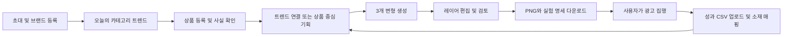

# PRD — 트렌드 기반 퍼포먼스 크리에이티브 에이전트

버전: 1.0 / 작성일: 2026-09-17 / 상태: 구현 기준 제안안

확인된 조건: **1인 개발, 6~8주**. 프로젝트 이름은 Growth tool이다. 월 예산, 기존 개발 숙련도, 외부 서비스 계정은 미확정이며 아래의 기본값으로 설계한다. 이 문서의 목표 수치와 비용은 검증할 가설·운영 예산이지 달성 실적이나 견적이 아니다.

## 1. 제품 정의와 핵심 결정

**패션·뷰티 셀러가 매일 확인한 쇼핑 트렌드를 자기 상품의 광고 기획으로 바꾸고, 수정 가능한 이미지 광고 3종을 만들어 실제 성과와 비교하는 웹 서비스.**

사용자에게 전달하는 첫 약속은 “상품 정보와 사진을 등록하면, 트렌드 근거가 있는 광고 소재 3종을 만들고 직접 수정할 수 있다”이다. ROAS 향상은 실험으로 검증할 가설이다.

### MVP 최종 완료 정의

MVP는 로컬 실행이나 내부 데모가 아니라 **외부 테스터가 공개 HTTPS 주소에서 직접 사용할 수 있는 비공개 베타**까지를 완료 범위로 한다. 초기에는 Vercel 기본 도메인을 MVP 주소로 사용할 수 있으며, 별도 도메인은 출시 필수 조건이 아니다.

- 초대받은 외부 사용자 5명 이상이 공개 URL에서 로그인하고 자기 워크스페이스를 생성할 수 있다.
- 트렌드 확인 → 상품 등록 → 3안 생성 → 편집·검토 → PNG/ZIP 다운로드의 핵심 경로를 외부 환경에서 완료할 수 있다.
- 네이버·AI 공급자 키는 배포 환경의 서버 비밀값으로 설정되고 브라우저 번들·로그·다운로드 파일에 노출되지 않는다.
- 서로 다른 테스터의 DB·파일·생성 결과는 분리되며, 다른 사용자의 ID나 URL을 알아도 접근할 수 없다.
- 오류 추적, 비용·쿼터 제한, 문의 경로, 알려진 한계, 삭제 요청 절차를 제공한다.
- 시크릿 브라우저와 실제 외부 네트워크에서 가입부터 다운로드까지 smoke test를 통과하고 결과를 출시 기록에 남긴다.

| 항목 | MVP 결정 | 이유 |
|---|---|---|
| 고객 | 국내 패션·뷰티 소규모 셀러, 워크스페이스당 운영자 1명 | 셀러와 대행사의 업무를 동시에 구현하지 않는다 |
| 핵심 채널 | Meta 이미지 광고를 염두에 둔 범용 정적 이미지 | 영상·다중 매체 집행을 8주 안에 함께 구현하기 어렵다 |
| 트렌드 | 네이버 쇼핑인사이트 + 운영자 큐레이션 | 접근이 검증된 데이터부터 반복 방문 가치 실험 |
| 신선도 | 일일 업데이트, 데이터 기준일·수집 시각 표시 | 일간 통계를 초단위 실시간 데이터처럼 표현하지 않는다 |
| 제작 결과 | 3개 기획안 × 1080×1080 이미지, 편집 가능한 앱 내부 레이어 | 3종의 실험 차이를 설명할 수 있고 검수 가능 |
| 성과 | 표준 CSV 업로드와 소재 버전별 비교 | 광고 API 승인이나 구매 추적에 출시가 종속되지 않음 |
| 집행 | 사용자가 다운로드 후 광고 관리자에서 직접 집행 | MVP에 광고비를 쓰는 기능이 없다 |
| 가격 실험 | 초대형 무료 PoC, 생성량 상한 | 무제한 무료와 불확실한 매출 정산의 비용 위험을 제한 |
| 시스템 | TypeScript 중심 모듈형 단일 앱 + 비동기 작업 | 1인이 개발·운영할 수 있는 구조 |

장기 비전인 실시간 소셜 트렌드, 매체 연동, 피로도 감지, 교체 제안은 유지한다. 다만 각 단계의 데이터·권한·성과 검증을 통과한 뒤 확장한다.

## 2. 문제와 검증할 가설

사용자가 제시한 실무 경험은 문제 발견의 출발점이다. 아직 50개 셀러의 수요나 성과 개선이 확인된 상태로 취급하지 않는다.

| 가설 | 실험 | 판단 기준 |
|---|---|---|
| H1. 기획·제작 반복 업무가 큰 비용이다 | 10명 인터뷰, 동일 상품 제작 시간 전후 비교 | 유효 참가자 중앙값 제작 시간 50% 이상 감소 |
| H2. 일일 트렌드가 재방문을 만든다 | 카테고리 맞춤 피드와 저장 행동 측정 | 활성화 사용자 중 4주차 재방문 30% 이상 |
| H3. 트렌드를 연결한 소재는 실제로 사용할 만하다 | 3안 중 다운로드·외부 집행 여부 확인 | 완성 프로젝트 중 1개 이상 다운로드 비율 60% 이상 |
| H4. 트렌드 소재가 광고 효율을 개선한다 | 추적 가능한 셀러의 동시 A/B 테스트 | 충분한 표본에서 방향성과 신뢰구간 확인; 출시 필수 조건은 아님 |
| H5. 제작 비용을 회수할 과금 의사가 있다 | 사용 후 유료 의향 인터뷰·별도 유료 제안 | 인터뷰 10명 중 3명 이상 구체적 유료 사용 의향; 실제 결제는 후속 검증 |

경쟁 제품이 “정적인 템플릿만 제공한다”거나 “리텐션 확보에 실패했다”는 주장은 이 PRD의 사실 전제로 사용하지 않는다. 차별화 가설은 **국내 카테고리 데이터 → 근거 있는 소구점 → 편집 가능한 소재 → 자기 광고 성과**의 연결이다.

## 3. 타깃과 PoC 모집

### 3.1 두 코호트

- **제작 검증 코호트 A:** 스마트스토어·쿠팡 중심 패션·뷰티 셀러. 제작 시간·다운로드·재사용을 측정한다. 전환 추적이 확인되지 않으면 ROAS를 표시하지 않는다.
- **성과 검증 코호트 B:** 자기 광고 계정과 구매 측정 수단이 있는 D2C 셀러. 가능하면 A 중 조건을 충족하는 셀러, 부족하면 자사몰 운영자를 추가 모집한다. 광고 단위 구매 금액·귀속 기준을 확인한 경우에만 ROAS를 비교한다.

50곳은 초기 연락·검증 대상 규모다. 초기에 50개 활성 계정을 확보했다고 가정하지 않는다. 순서는 후보 50곳 → 인터뷰 10곳 → 밀착 파일럿 5곳 → 피드백 반영 후 최대 50개 워크스페이스로 확대한다. 성과 실험은 추적 가능한 5곳 이상을 별도로 확보한다.

브랜드 사진 사용 권한, 제품 정보 확인 가능성, 주당 소재 제작 수요를 모집 조건으로 둔다. 건강기능식품·의료기기, 미성년자 타깃, 정치·성인 카테고리는 초기 대상에서 제외한다. 뷰티 제품의 효능 표현은 입력 증빙과 검토 절차를 거친다.

### 3.2 대표 사용자 시나리오

“아침에 여성 의류 트렌드를 보고 저장한다. 보유한 재킷 사진과 가격을 등록한다. 서비스가 ‘가을 출근룩’과 상품의 확인된 특징을 연결한다. 과장된 표현을 고치고, 제목만 다른 배너 3개를 만든다. 1개를 수정해 내려받아 집행한 뒤 광고 관리자 보고서를 업로드한다.”

## 4. 범위와 단계

| 단계 | 포함 | 제외·다음 단계 |
|---|---|---|
| P0: 8주 MVP | 로그인, 브랜드 1개, 제품 수동 등록, 허용 도메인 URL 가져오기, 일일 쇼핑 트렌드, 운영자 큐레이션, 비전 분석, 3안 기획·생성, 제한 편집기, 검토, PNG/프로젝트 ZIP, 성과 CSV, 사용량 관리 | 아래 P1/P2 |
| P1: MVP 후 | Meta 읽기 전용 성과 동기화, 4:5·9:16, 레퍼런스 비전 태깅, 반복 성과의 저하 알림, 유료 크레딧·구독 실험 | 자동 예산 조정·자동 교체 |
| P2: 검증 후 | 승인형 광고 초안 생성·배포, X 트렌드, 허가된 데이터 파트너, 다중 브랜드·역할, 정산 파일럿 | 무인 집행은 별도 위험·성과 검증 이후 |
| 장기 | TikTok·카카오모멘트·몰로코 커넥터, 영상, 충분한 데이터 기반 레이아웃 클러스터링·피로도 추천 | 매체별 접근성·비용을 검증하기 전 일정 확정 금지 |

P0에 포함하지 않는 항목: Airflow 클러스터, 자체 이미지 모델 학습, 임의 웹 전체 스크래핑, Figma 플러그인, PSD/Figma 원본 출력, 세밀한 포토샵 편집, 모바일 편집기, 주문·고객 개인정보 수집, 결제·자동 수수료 청구, 자동 콜드메일, AI가 예측한 CTR/ROAS를 실측처럼 보여주는 기능.

6주 시점은 내부 알파 목표다. 8주 외부 PoC 출시에 필요한 권한 격리·검수·비용 한도·복구 검증은 단축하지 않는다. 일정이 밀리면 허용 URL 가져오기와 성과 비교의 보조 UI를 먼저 축소하고 수동 등록·표준 CSV 경로를 유지한다.

## 5. 데이터 소스의 제품 계약

| 소스 | P0 사용 방식 | 신선도·한계 | 장애·접근 불가 시 |
|---|---|---|---|
| 네이버 쇼핑인사이트 | 등록한 카테고리·키워드의 공식 API 추이 | 일간 클릭 상대지수; 전체 실시간 급상승 검색어 목록 API로 취급하지 않음 | 마지막 성공 데이터+기준일, 낡은 추천 제외 |
| 자체 큐레이션 | 운영자가 출처 링크와 직접 작성한 요약·활용 가설 등록 | ‘운영자 선정’ 표시; 정량 순위와 구분 | 콘텐츠가 없으면 억지로 채우지 않음 |
| Meta 광고 라이브러리 | 공식 사이트로 나가는 탐색 링크·개인 북마크 | 공개 소재만으로 경쟁사 CTR·CVR·ROAS 검증 불가; 국내 상업광고 API 전량 수집 전제 제외 | 자동 수집 없이 링크 탐색 유지 |
| TikTok Creative Center | 탐색 링크 | 공식 Top Ads에 성과 관련 정보가 있어도 공개 API·재배포 허가로 간주하지 않음 | 링크만 제공 |
| X 트렌드 | P2, API 비용·지역·접근권 검증 후 | 지역 트렌드 API는 존재; 계정의 사용 가능 여부 미검증 | 비활성화 |
| Signal.bz / 나무위키 | P0 자동 수집 제외 | 이번 조사에서 상업적 수집·재배포 허가와 안정적 공식 API를 확인하지 못함 | 데이터 제휴·허용 범위 확인 후 커넥터 추가 |

네이버 문서상 쇼핑인사이트는 일 1,000회 한도이며 키워드 요청은 최대 5개 쌍이다. P0는 카테고리별 합계 100개의 운영자 관리 키워드로 시작한다. 이는 무한한 신조어 자동 발견 서비스가 아니다. [네이버 API 명세](https://developers.naver.com/docs/serviceapi/datalab/shopping/shopping.md), [호출 한도](https://developers.naver.com/products/intro/plan/plan.md)

Meta 공개 라이브러리 API의 대상 범위와 필드는 한국 경쟁사의 구매성과 데이터베이스를 보장하지 않는다. UI에서는 ‘레퍼런스’, 자기 CSV와 연결된 경우에만 ‘내 광고 실측 성과’라고 표시한다. [Meta 공식 API 안내](https://www.facebook.com/ads/library/api/)

추가 근거·미확인 사항은 [RESEARCH](RESEARCH.md)에 기록한다. API 접근 가능성과 데이터의 저장·노출 권한은 별개이며, 외부 PoC 전 공급자 조건을 확인한다.

## 6. 사용자 여정과 화면

| 화면 | 주요 내용·행동 | 필수 상태 |
|---|---|---|
| 온보딩 | 이메일 로그인, 브랜드명, 카테고리, 색상, 로고, 금지 표현 | 초대 만료, 미완료, 완료 |
| 오늘의 트렌드 | 카테고리, 상승 추이, 근거 기간, 저장, ‘이 트렌드로 제작’ | 최초 수집 전, 정상, 일부 실패, 데이터 오래됨 |
| 제품 | 상품명·가격·사진·링크, 추출값과 추정값 구분, 사실 확인 | 업로드 오류, URL 실패, 확인 필요, 사용 가능 |
| 기획 | 목표, 타깃, 확인된 소구점, 트렌드 연결 이유, 실험 변수 | 연결 근거 부족, 일반 상품 중심 기획, 승인 |
| 제작 작업 | 현재 단계, 완료 수/3, 예상 대기, 취소·재시도 | 대기, 실행, 일부 성공, 실패, 완료 |
| 편집·검토 | 캔버스, 레이어, 문구·위치·색상 수정, 검토 결과 | 미저장, 충돌, 재검토 필요, 내보내기 가능 |
| 성과 | CSV 양식·업로드, 광고 ID↔소재 버전 매핑, 비교 | 미매핑, 데이터 없음, 비교 불가, 정상 |
| 설정·운영 | 사용량, 삭제, 작업 오류, 소스 갱신 상태·중지 | 한도 도달, 공급자 장애 |

편집은 데스크톱 가로 1280px 이상을 우선 지원한다. 모바일은 트렌드·소재 확인만 제공하며 편집 진입 시 데스크톱 안내를 표시한다. 핵심 동작에 키보드·명시적 레이블을 제공한다.

## 7. 기능 요구사항과 수용 기준

### FR-01. 계정·브랜드·사용량

- 초대 기반 이메일 인증, 사용자당 기본 워크스페이스 1개, 브랜드 1개. 타 조직 데이터 접근은 모든 계층에서 차단한다.
- 브랜드명·카테고리·주요 색상·로고·금지 표현 저장. 협업 초대·역할 관리 UI는 후속이다.
- 무료 PoC 기본 상한: 주 5세트(15개 변형), 워크스페이스 동시 생성 1건. 관리자만 별도 쿼터 부여 가능.
- **AC:** 다른 계정의 URL·파일 ID를 알아도 읽기·수정·다운로드할 수 없다. 동시 요청으로 한도를 초과할 수 없다. 서버 키가 브라우저에 노출되지 않는다.

### FR-02. 제품 등록·확인

- 필수: 상품명, 패션/뷰티 세부 카테고리, 제품 사진 1~5장, 확인된 특징 1개 이상. 가격·프로모션·상품 URL은 선택이다.
- JPG/PNG/WebP, 파일당 10MB 이하, 긴 변 6,000px 이하. 서버가 실제 형식·해상도를 검사하고 EXIF를 제거한다.
- URL은 승인된 도메인의 공개 메타데이터만 읽는다. 스마트스토어·쿠팡 URL은 추적·참조용으로 저장할 수 있으나 자동 추출 성공을 보장하지 않는다. 접근 거부·로그인·동적 페이지는 수동 폼으로 전환한다.
- 이미지로 확인 가능한 색·형태·배치를 분석한다. 소재 성분, 방수 성능, 미백 효과 등은 이미지에서 사실로 확정하지 않는다.
- 사용자 확인 전의 추출값은 광고 카피에 사용하지 않는다. 프로모션에는 종료일·근거를 받는다.
- **AC:** URL 읽기가 실패해도 수동 등록으로 제작을 완료한다. 확인하지 않은 가격·효능이 생성 결과에 들어가지 않는다.

### FR-03. 일일 트렌드 피드

- 운영자 키워드 목록, 28일 시계열, 최근 3일 대 직전 7일 변화, 데이터 기준일과 수집 시각을 제공한다.
- 기본 수집은 매일 07:00 Asia/Seoul, 실패·지연 재확인은 12:00과 18:00. 상위 공급자의 발표 시각이나 당일 데이터 제공을 보장하지 않는다.
- 카테고리 필터·키워드 검색·저장·소재 제작 연결. 네이버 상대지수, 자체 추천 순위, 수동 큐레이션을 구분한다.
- **AC:** 다른 조회 묶음의 100을 같은 절대 검색량으로 비교하지 않는다. 누락은 0으로 채우지 않는다. 최신 관측일이 3일 이상 오래되면 ‘업데이트 지연’, 7일 초과면 신규 추천에서 제외한다.

### FR-04. 기획과 실험 설계

- 상품의 확인된 사실과 선택한 트렌드 관측을 입력으로 사용하고, 소구점·타깃·카피·연결 근거를 구조화해 출력한다.
- 기본 ‘카피 비교’ 모드: 배경·제품 배치·가격·CTA를 고정하고 헤드라인만 A/B/C로 바꾼다. A는 상품 중심, B/C는 관련 트렌드의 서로 다른 표현이다.
- ‘아이디어 탐색’ 모드: 소구점·배경·레이아웃이 다른 3안도 허용하되 여러 변수가 달라 단일 요소의 효과를 분리할 수 없다고 표시한다.
- 연결이 약하거나 민감한 트렌드는 일반 상품 중심 기획을 제안한다. 매칭 점수는 내부 추천값이며 예측 CTR이 아니다.
- **AC:** 모든 기획에 product_version, fact_ids, trend_snapshot_id 또는 트렌드 미사용 이유, 비교 변수, prompt_version이 남는다. 없는 트렌드를 최신 유행처럼 생성하지 않는다.

### FR-05. 레이어형 소재 생성

- 1080×1080, sRGB, PNG. 배경·원본 제품 또는 누끼 이미지·로고·헤드라인·가격·CTA를 별도 객체로 저장한다.
- AI는 배경과 카피 초안을 생성한다. 판매 제품의 라벨·모양을 이미지 생성으로 재현하지 않고 승인된 원본을 합성한다.
- 누끼 실패는 원본 사진을 담은 카드형 구도로 전환한다. 품질 불량을 성공한 누끼처럼 처리하지 않는다.
- 3개의 제한된 구도 패밀리에서 자동 배치한다. 레이아웃 제약은 안정적인 렌더링 수단이고, 기획·카피·배경은 상품과 트렌드에 맞게 생성한다.
- **AC:** 각 변형의 텍스트를 재생성 없이 수정할 수 있다. 2개 성공·1개 실패 시 성공 결과가 유지된다. 동일 요청의 중복 실행이 사용자 쿼터를 두 번 차감하지 않는다.

### FR-06. 제한 편집기·내보내기

- 텍스트 수정, 글자 크기·색, 제품·텍스트 이동 및 크기 조절, 배경색, 레이어 순서, 실행 취소/다시 실행, 자동 저장.
- 폰트는 라이선스를 기록한 Noto Sans KR 1종으로 시작. 본문 최소 글자 크기와 안전 여백을 검사한다.
- 최종 PNG 및 ZIP: PNG 3장(성공한 결과만), 카피.txt, 실험 설명.md, manifest.json, scene.json, 사용 권한이 있는 자산. 외부 라이브러리 소재는 넣지 않는다.
- 내보내기마다 불변 버전 ID를 부여하고 파일명·실험 명세에 포함한다. 광고 수정 시 새 버전을 집행해야 비교가 유지된다.
- **AC:** 새로고침 후 편집이 복원된다. 텍스트 넘침·이미지 미로딩·폰트 미로딩 상태에서는 완성 파일을 반환하지 않는다. Figma/PSD 레이어 호환은 약속하지 않는다.

### FR-07. 사전 검토

- 규칙 검사: 확인되지 않은 수치·효능, 할인 기간, 금지 표현, 브랜드 금칙어, 이미지·텍스트 안전성, 콘텐츠 권한 확인, 레이아웃 넘침.
- 상태: 통과 / 확인 필요 / 차단. AI의 판단 근거와 수정할 필드를 표시한다.
- 경고는 사유 확인 후 내보내기 가능하되 승인 기록을 남긴다. 차단은 문제 수정 후 재검사해야 한다. 편집 후 기존 검토는 만료된다.
- 밈·캐릭터·유명인·상표의 권리 적합성을 AI가 보증하지 않는다. 입력 자료의 사용 권한을 확인받고 불명확한 소재는 사용하지 않는 경로를 제공한다.
- **AC:** 차단 상태의 버전은 UI와 API 양쪽에서 내보낼 수 없다. ‘법적 안전 보장’이나 ‘매체 승인 보장’으로 표시하지 않는다. 자동 심사 통과율을 ROAS처럼 제시하지 않는다.

### FR-08. 성과 업로드·비교

- 제공한 표준 CSV만 필수 지원. 광고 관리자 보고서의 임의 열을 자동 추측하지 않고, 표준 양식으로 변환하는 안내·미리보기를 제공한다.
- 필수: 날짜, 매체, 광고계정 ID, 광고 ID, 통화, 타임존, 노출, 링크 클릭, 비용, 집계·귀속 설정. 선택: 구매 건수, 구매 금액, 소재 내보내기 버전 ID.
- 광고 ID와 소재 버전을 사용자가 매핑한다. 변경 이력·적용 기간을 남겨 같은 광고 ID가 다른 소재를 쓴 기간을 분리한다.
- CTR=링크 클릭/노출, CPC=비용/링크 클릭, 구매 CVR=구매/링크 클릭, ROAS=구매 금액/비용. 0 분모는 ‘계산 불가’, 관측 누락은 ‘데이터 없음’이다.
- 구매 지표가 없으면 CTR·CPC만 표시한다. 통화·타임존·귀속 설정·지표 정의가 다르면 직접 비교를 차단한다. 서로 다른 매체의 구매 금액을 합쳐 중복 없는 매출로 표시하지 않는다.
- **AC:** 중복 업로드가 합계를 늘리지 않는다. 부분 날짜 중첩은 기존 행과 차이를 보여주고 명시적 교체 확인을 받는다. 결측 구매 금액을 0원 매출로 처리하지 않는다. 출처는 ‘사용자 업로드’로 명시한다.

### FR-09. 레퍼런스 탐색

- Meta/TikTok 공식 탐색 링크, 사용자 개인 북마크 URL·메모, 운영자의 자체 작성 구도 설명을 제공한다.
- P0는 경쟁사 이미지를 자동 저장·재배포하거나 권리 불명 이미지의 비전 분석을 수행하지 않는다. P1의 비전 태깅은 권한 확인한 입력만 대상으로 한다.
- **AC:** ‘공개 레퍼런스’와 ‘내 광고 실측 성과’가 구분된다. 외부 링크에는 출처가 표시되며 해당 URL을 서버가 자동 탐색하지 않는다.

### FR-10. 운영·복구·삭제

- 운영자는 키워드·큐레이션·초대·생성 한도·소스 중지·작업 실패를 관리한다. 관리자 권한은 클라이언트 입력으로 승격할 수 없다.
- 과금 공급자 비용·잔여 예산·실패율을 확인하고 신규 생성 중지 스위치를 제공한다. 트렌드 수집 장애는 편집·다운로드를 막지 않는다.
- 탈퇴·프로젝트 삭제 시 작업을 취소하고 자산·DB를 삭제 큐에 넣는다. 기본 활성 데이터 삭제 목표 7일, 백업 잔존 목표 30일 이내로 하되 실제 공급자 보존 조건을 출시 전에 확인·고지한다.
- **AC:** 삭제 후 신규 서명 URL 발급과 작업 재시작이 불가능하다. 복구 시 삭제 요청을 다시 적용한다.

## 8. 비기능 요구사항

| 영역 | 목표·검증 |
|---|---|
| 규모 | 초기 50 워크스페이스, 편집·조회 동시 사용자 10명, 생성 전체 동시 3건에서 시작 |
| 응답 | 캐시된 주요 API p95 1초 이하, 작업 접수 p95 2초 이하; 한국 테스트 환경·네트워크 조건 기록 |
| 생성 | 3종 결과 목표 p50 90초/p95 240초, 큐 대기는 별도 표시. 실측 30세트에서 평가; 초과 시 진행 상태와 부분 결과 제공 |
| 성공률 | 정상 입력에서 완전 성공 90% 이상, fallback 포함 사용 가능한 결과 95% 이상 목표. 공급자 장애 포함/제외 값을 함께 기록 |
| 보안 | 테넌트 격리, 서명된 비공개 파일, 서버 전용 키, 업로드 검증, URL SSRF 방어, 입력의 프롬프트 인젝션 격리 |
| 재현성 | 모델·프롬프트·상품·트렌드·장면·폰트 버전, 입력 해시, 공급자 요청 ID, 비용 기록. 같은 AI 출력을 다시 얻는다고 보장하지 않고 기존 산출물 재사용 |
| 장애 대응 | 단계별 체크포인트, 제한 재시도, 중복 방지, 공급자 회로 차단, 작업별 취소·부분 성공 |
| 접근성 | 키보드 조작, 폼 오류 레이블, 기본 텍스트 대비, 상태를 색상만으로 표시하지 않음 |
| 복구 | DB RPO 24시간/RTO 1영업일 목표. 파일은 별도 백업·복원 검증; DB 백업만으로 자산까지 복구된다고 가정하지 않음 |

## 9. AI 품질 평가

평가셋은 사용 허가된 패션 10개·뷰티 10개 상품이다. 투명/불투명 배경, 긴 상품명, 여러 제품, 작은 라벨, 반사 소재를 포함한다. 공개 경쟁사 이미지를 무단 복제해 평가셋을 구성하지 않는다.

| 항목 | 파일럿 출시 기준 |
|---|---|
| 사실성 | 검수한 60개 소재에서 근거 없는 가격·효능 0건; 발견 시 카피 경로 수정·재평가 |
| 제품 보존 | 20개 상품 모두 식별 가능한 원본 제품 유지; 누끼 불량은 원본 카드 fallback |
| 편집성 | 60개 소재 모두 텍스트와 제품 객체가 분리되고 저장 후 복원 가능 |
| 한글·레이아웃 | 필수 텍스트 잘림·폰트 누락 0건; 줄수 초과는 내보내기 차단 |
| 유용성 | 셀러 5명 평가에서 70% 이상이 ‘수정 후 사용 가능’ 이상, 점수와 자유 의견 기록 |
| 트렌드 연결 | 출처·기간이 있는 연결 근거 제공, 무관한 연결은 거절 또는 상품 중심으로 전환 |

## 10. 계측과 성과 실험

**북극성 지표:** 주간 ‘트렌드를 선택해 소재를 만들고 1개 이상 내보낸 워크스페이스 수’. 단순 방문 DAU만으로 성공을 판단하지 않는다.

| 지표 | 정의 | PoC 목표 |
|---|---|---|
| 활성화율 | 가입 7일 이내 첫 내보내기 워크스페이스 / 가입 후 7일 지난 워크스페이스 | 40% 이상 |
| 제작 채택률 | 1개 이상 내보낸 프로젝트 / 3안 생성 완료 프로젝트 | 60% 이상 |
| 4주 리텐션 | 첫 내보내기 후 22~28일에 피드 저장·기획 생성·편집·내보내기 중 1회 이상 수행 / 28일 관찰 가능한 활성화 코호트 | 30% 이상 |
| 시간 절감 | 동일 상품의 기존 수작업 대비 승인·다운로드까지 총 경과 시간 중앙값 | 50% 이상 감소 |
| 외부 집행률 | 집행 증빙 또는 광고 ID 연결 소재가 있는 워크스페이스 / 내보낸 워크스페이스 | 30% 이상 |
| 운영 부담 | 창업자의 지원·큐레이션 시간 / 주간 활성 워크스페이스 | 주 15분 이하 목표 |

서버 이벤트: workspace_created, product_confirmed, trend_saved, brief_approved, generation_started/completed/failed, creative_edited, policy_reviewed, export_completed, metrics_imported, ad_mapped. 공통 속성은 event_id, timestamp, workspace_id, project_id, 버전, source, duration, error_code. 카피 원문·사진·개인정보를 분석 이벤트에 넣지 않는다.

A/B는 광고 매체에서 같은 타깃·예산·기간·입찰·게재위치로 무작위 분할 가능한 실험을 우선 사용한다. 서로 다른 기간의 ROAS 단순 전후 비교는 참고 분석이다. 기본은 기존 소재 A 대 신규 소재 B의 사전 지정 비교이며, 3개를 동시에 시험하면 다중 비교를 고려한다.

가령 CTR 1% → 1.3%를 양측 5%, 검정력 80%로 감지하려면 단순 독립 비율 근사에서 **군당 약 2만 회 노출**이 필요하다. 실제 광고는 반복 노출·전달 최적화가 있으므로 이 값은 규모 감각일 뿐 플랫폼 실험 설계를 대체하지 않는다. CTR 결과로 ROAS 개선을 선언하지 않는다. CVR·ROAS는 구매 지연·반품·표본 부족까지 별도 평가한다. 중간 수치가 좋아졌다는 이유만으로 임의 조기 종료하지 않는다.

## 11. 수익모델과 단위 경제

### 11.1 원안의 성과 수수료를 적용할 조건

‘전환 매출의 3~5%’를 MVP 자동 과금으로 구현하지 않는다. 스마트스토어·쿠팡 외부 광고에서 소재별 구매 금액을 안정적으로 얻는지, 계정의 데이터가 실제 정산 매출과 어떻게 다른지 확인되지 않았기 때문이다. UTM만으로 구매 매출이 자동 확인된다고 가정하지 않는다.

후속 성과 과금 파일럿은 다음을 정한 소수 고객에게만 적용한다: 측정 가능한 구매 이벤트, 집계 대상 광고 ID, 귀속 창·타임존·통화, 반품·취소 조정 방식, 중복 귀속 처리, 데이터 접근 종료 시 처리, 이의제기와 월별 확정 절차. 매체 귀속 매출·실결제 매출·증분 매출은 별개다. 이 조건들은 계약·정산 설계의 검토 항목이며 본 문서가 법적 유효성을 보장하지 않는다.

3~5%는 순이익이 아닌 매출에 대한 비율이다. 비용 회수와 셀러 마진의 양쪽을 검증한다. 광고비는 셀러가 매체에 직접 지급하므로 ‘완전한 제로 리스크’로 홍보하지 않는다.

### 11.2 P0 비용 가정

초기 가격 기준 모델은 GPT Image 1.5 medium 1024×1024 배경당 $0.034, Photoroom 기본 배경 제거 이미지당 $0.02를 참고한다. 입력 토큰·재시도·세금·플랜 최소 약정 등은 별도다. [이미지 모델 가격](https://developers.openai.com/api/docs/models/gpt-image-1.5), [Photoroom 가격](https://www.photoroom.com/api/pricing)

| 비용 항목 | 계획 가정 |
|---|---|
| 한 세트 AI·처리 변동비 | $0.08~$0.30. 배경 1개 공유~3개 별도, 누끼 캐시, 텍스트·비전·렌더·재시도 여유 포함한 예산 가정 |
| 활동량 상한 예시 | 50곳 × 주 5세트 × 4주 = 월 1,000세트·3,000개 변형 |
| 위 활동량의 변동비 | 월 $80~$300; 실제 지원 시간·고객 획득비 제외 |
| 앱·DB·작업·모니터링·메일 | 월 $60~$150의 계획 범위, 서비스별 실견적 미확정 |
| 총 계획 범위 | 월 $140~$450. 환율 1,400원/$를 계산 가정으로 쓰면 약 19.6만~63만원; 실제 환율 주장 아님 |
| 초기 운영 기본 예산 | 월 $300 알림·차단 기준. 예상 지출이 넘으면 초대·생성량 조정, 최대 규모 동시 제공을 보장하지 않음 |

예시: 셀러 1곳 월 20세트 × 세트당 $0.15 = $3, 고정비 배분 $2라면 지원비 제외 월 $5. 가정 환율로 7,000원이며 4% 수수료만으로 회수하려면 정산 대상 매출 175,000원이 필요하다. 실제 수익성은 지원비·미수·실패 생성까지 더해 재산정한다.

PoC 이후 선택지는 제한 무료 + 생성 크레딧/구독, 또는 추적 가능한 고객에 한정한 성과 수수료다. 9개월 이후 B2B 확장은 월 기준이 아니라 반복 사용·결제 의향·지원 부담 검증을 통과한 뒤 진행한다.

## 12. 일정과 출시 게이트

| 주차 | 목표 | 종료 조건 |
|---|---|---|
| 1주 | 계정·API·데이터 조건 검증, 모델·렌더 스파이크, 앱 기반 | 실제 사진 3개로 분석→배경→합성→PNG 검증, 수집 응답 확인 |
| 2주 | 인증·격리·제품 등록·트렌드 수집 | 수동 입력 완료, 두 테넌트 격리, 실데이터 피드 |
| 3주 | 기획·작업 상태·비용 예약 | 스키마 기반 3안, 중복·실패·한도 검증 |
| 4주 | 생성·레이어 편집·내보내기 | 제품부터 다운로드까지 내부 완주 |
| 5주 | 검토·성과 CSV·매핑 | 차단 소재 export 방지, 수치 재계산·중복 검증 |
| 6주 | QA·5곳 내부 파일럿 | 20상품 평가, 실제 제작 관찰·오류 수정 |
| 7주 | 사용성·비용·보안·복구 보완 | 출시 체크리스트 통과, 10곳 이상 확대 판단 |
| 8주 | 공개 URL 기반 비공개 PoC 출시·회고 | 외부 테스터가 공개 HTTPS 주소에서 핵심 경로를 완주하고, 모집 대상 50곳에 순차 제공 |

1인 기준 이슈 작업 32일 + 인터뷰·운영·지연 버퍼 8일의 40영업일 계획이다. 공급자 심사 대기나 고객 실험 관찰 기간은 개발 공수와 다르다. 4주 리텐션·광고 성과 판정은 최초 활성화 이후 충분한 기간까지 출시 후에도 계속한다.

**출시 필수:** 테넌트·파일 격리, 정상 경로와 수동 fallback, 20상품 품질 기준, 제한 비용, 일일 수집 관측, CSV 계산 정확성, 삭제·복구, 외부 제공 데이터 조건 확인. 데모 데이터만으로 실데이터 출시 게이트를 통과할 수 없다.

## 13. 결정 기록과 남은 확인

| 항목 | 현재 기본값 | 바뀌는 조건 |
|---|---|---|
| 개발 인력·기간 | 사용자 확인: 1인·6~8주 | 사용자 범위 변경 |
| 예산 | 월 $300 운영 상한 가정 | 사용자가 예산 지정하거나 실측 원가 초과 |
| 채널 | 이미지 다운로드 + Meta 성과 표준 CSV | 읽기 API 승인·실계정 검증 후 P1 |
| 상품 URL | 허용 도메인만 시도, 업로드 필수 fallback | 도메인별 적법한 접근·추출 성공률 확인 |
| 누끼·이미지 AI | Photoroom + OpenAI API | 계정 접근 불가/평가 실패면 T01에서 공급자 변경 기록 |
| 지역·보관 | 한국 사용자, 가용한 가까운 DB 지역, 외부 AI 처리 | 출시 전 실제 처리·보관 지역과 약관 확인 |
| 수수료 | 미구현, 무료 상한 PoC | 전환·정산 조건 및 유료 합의 검증 |

개발 시작에 필요한 외부 준비물은 네이버 개발자 앱, OpenAI API 결제 가능한 프로젝트, Photoroom 계정, Supabase·Trigger.dev·Vercel 프로젝트, 인증 메일 발송 설정, 사용 허가된 상품 샘플과 파일럿 셀러다. 비밀키는 문서나 이슈에 붙이지 않고 서버 환경변수로 관리한다.

구현 상세는 [ARCHITECTURE](ARCHITECTURE.md), 개발 단위와 완료 조건은 [BACKLOG](BACKLOG.md)를 따른다.
