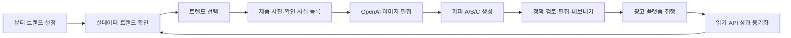

# Growth tool PRD — Beauty Live MVP

- 상태: 구현 기준 문서
- 버전: 2.0
- 작성일: 2026-09-17
- 목표: 1인 개발 6~8주, 뷰티 셀러 50곳 PoC
- 공개 서비스: https://growthtool.vercel.app

## 1. 제품 정의

Growth tool은 뷰티 셀러가 매일 반복하는 **트렌드 탐색 → 제품 사진 기반 광고 소재 생성 → 매체 성과 확인**을 하나의 피드백 루프로 연결하는 퍼포먼스 마케팅 에이전트다.

제품은 샘플 트렌드, 샘플 광고, 가짜 성과를 표시하지 않는다. 공급자 자격증명이 없거나 API가 실패하면 해당 소스의 연결 상태와 해결 방법만 표시한다.

## 2. 문제와 사용자

초기 사용자는 네이버 스마트스토어·쿠팡 등에서 뷰티 제품을 판매하며 주당 여러 소재를 만들어야 하는 1인 셀러와 소규모 D2C 마케터다.

이들은 네이버·X·TikTok에서 트렌드를 따로 찾고, 제품 사진을 편집해 카피별 배너를 만든 뒤, Meta·TikTok·Google Ads·Moloco에서 성과를 다시 대조한다. 도구 사이에 소재 ID와 기획 근거가 연결되지 않아 다음 소재 결정이 개인의 기억과 감에 남는다.

## 3. MVP 목표와 비목표

### 목표

1. 네이버 쇼핑, X, TikTok의 실제 뷰티 트렌드 신호만 한 화면에 보여준다.
2. 사용자가 올린 실제 제품 사진과 확인된 사실을 OpenAI 이미지 편집·카피 API에 전달해 광고 소재 3종을 만든다.
3. Meta Ads, TikTok Ads, Google Ads, Moloco의 읽기 API에서 일별 광고 성과를 가져온다.
4. API 미연결, 권한 오류, 데이터 없음, 정상 응답을 사용자가 구분할 수 있다.
5. 생성물은 편집·검토 후 PNG와 실험 명세 ZIP으로 내보낼 수 있다.

### 비목표

- 광고 예산을 쓰는 캠페인 생성·수정·자동 교체
- 근거 없는 효능·랭킹·할인·희소성 문구 생성
- TikTok Creative Center의 비공개 엔드포인트 무단 사용
- 서로 다른 통화·귀속 설정을 임의 환산한 통합 ROAS
- 패션 또는 다른 커머스 카테고리 지원

## 4. 성공 지표

| 단계 | 핵심 지표 | 출시 기준 |
|---|---|---|
| 활성화 | 가입 후 첫 실데이터 트렌드 확인 | 연결 사용자 중 70% |
| 제작 | 제품 등록부터 소재 3종 생성 완료 | 중앙값 5분 이하 |
| 품질 | 제품 패키지·로고·라벨 보존, 허위 주장 없음 | 동의 받은 20개 제품 수동 평가 80% 이상 |
| 사용 | 주간 소재 생성 워크스페이스 | PoC 50곳 중 20곳 이상 |
| 성과 | 광고 ID가 연결된 소재의 CTR/CVR/ROAS 조회 | 연결 계정의 95% 일별 동기화 |
| 리텐션 | 4주차 주간 재방문 | 활성 PoC의 35% 이상 |

ROAS 개선은 사전 보장하지 않는다. 동일 타깃·예산·기간으로 집행된 실험에서만 방향성을 비교한다.

## 5. 사용자 흐름

## 6. 기능 요구사항

### FR-01 뷰티 전용 온보딩

- 브랜드명, 대표 색상, 금지 표현을 받는다.
- 카테고리는 `beauty`로 고정한다.
- 기존 패션 워크스페이스는 다음 설정 저장 시 뷰티로 전환 안내한다.

### FR-02 실제 트렌드 수집

- 네이버 쇼핑 인사이트: `화장품/미용(50000002)` 내 최대 5개 키워드 그룹의 최근 14일 상대 클릭 지수를 조회한다.
- X: `/2/trends/by/woeid/{woeid}`로 지역 트렌드를 가져온 뒤 뷰티 어휘와 일치하는 항목만 표시한다. 기본 WOEID는 환경변수로 바꿀 수 있다.
- TikTok: 공식 Creative Center 공개 페이지는 출처 링크로 제공한다. 공식 공개 Trends API가 문서화되지 않았으므로, 이용 권한이 있는 공급자의 JSON 피드 URL과 토큰을 환경변수로 연결한다.
- 모든 항목에 공급자, 출처 URL, 관측 시각, 점수 산식의 의미를 표시한다.
- 응답이 없으면 빈 목록을 보여주며 샘플 키워드를 넣지 않는다.

### FR-03 상품 등록

- 상품명, 뷰티 세부 카테고리, 확인된 특징, 제품 사진 1장을 필수로 받는다.
- 가격은 선택이다.
- JPG, PNG, WebP, 10MB 이하만 받으며 서버에서 디코딩·크기 검증한다.
- 인증 환경에서는 Supabase private Storage와 RLS로 워크스페이스를 격리한다.

### FR-04 실제 AI 소재 생성

- 카피는 OpenAI Responses 구조화 출력으로 A/B/C 세 안을 만든다.
- 이미지는 OpenAI Images Edit에 사용자가 올린 원본을 입력하고 `input_fidelity=high`로 요청한다.
- 제품 형태, 패키지, 로고, 라벨, 색상, 비율을 보존하도록 프롬프트에 명시한다.
- 공정한 카피 실험을 위해 세 안은 같은 생성 이미지·보조 문구·CTA를 쓰고 헤드라인만 바꾼다.
- `OPENAI_API_KEY`가 없으면 503과 연결 안내를 반환하며 결정론적 데모 생성기를 사용하지 않는다.
- 주당 생성 한도는 워크스페이스당 5세트다.

### FR-05 안전성·권리 검토

- 확인 사실에 없는 효능·순위·보장·할인·희소성을 금지한다.
- 금지 표현이 발견되면 내보내기를 차단한다.
- 생성 결과는 초안이며 사용자는 광고 집행 전에 화장품 표시광고 규정, 권리, 매체 정책을 확인한다.

### FR-06 편집·내보내기

- 헤드라인, 보조 문구, CTA, 배경색을 편집한다.
- 1080×1080 PNG, 카피, 실험 메모, scene JSON, manifest를 ZIP으로 내보낸다.
- AI 생성 키 비주얼을 PNG 배경으로 포함한다.

### FR-07 광고 성과 직접 연동

공통 정규화 필드: `platform, date, account_id, campaign_id/name, ad_id/name, currency, impressions, clicks, spend, purchases, revenue`.

- Meta Marketing API: 광고 계정 `/insights`, 일별·광고 수준, `actions/action_values`에서 구매와 구매 금액을 추출한다.
- TikTok Marketing API: Integrated Reporting `report/integrated/get`, 일별·광고 수준을 조회한다.
- Google Ads API: OAuth refresh token으로 access token을 받은 뒤 v25 `googleAds:searchStream`과 GAQL을 사용한다.
- Moloco: 읽기 전용 API Key로 16시간 access token을 만든 뒤 `analytics-detail`을 호출한다.
- 네 플랫폼 요청은 서로 독립적으로 실행한다. 한 플랫폼 실패가 다른 결과를 숨기지 않는다.
- 서로 다른 통화가 섞이면 합산 KPI를 표시하지 않고 플랫폼별 원본 행만 보여준다.
- CSV 업로드 경로는 제공하지 않는다.

### FR-08 관측성과 운영

- `/api/health`는 비밀값 없이 통합별 설정 여부만 반환한다.
- 각 공급자 응답에 마지막 동기화 시각, 연결 여부, 오류 코드를 포함한다.
- 원격 API 토큰과 키에는 `NEXT_PUBLIC_` 접두사를 사용하지 않는다.

## 7. 데이터·보안

- Supabase Auth, PostgreSQL, private Storage를 사용한다.
- 사용자가 올린 원본·파생 이미지에는 workspace_id를 강제하고 RLS를 적용한다.
- OpenAI 요청은 `store:false`를 사용한다. Images API 결과는 사용자 워크스페이스에만 저장한다.
- 광고 플랫폼 토큰은 서버 환경변수로만 읽는 단일 PoC 계정 방식이다. 다중 고객 OAuth 토큰 저장은 KMS 기반 암호화와 앱 심사를 갖춘 후 도입한다.
- 삭제 요청은 워크스페이스 데이터와 자산 삭제 작업을 생성한다.

## 8. 기술 스택

| 영역 | 선택 |
|---|---|
| Web | Next.js 16 App Router, React 19, TypeScript |
| UI | SEED Design React/CSS, 제품 전용 레이아웃 CSS |
| DB/Auth/Storage | Supabase |
| AI | OpenAI Responses + Images Edit, 선택적 Photoroom |
| 트렌드 | Naver DataLab, X API v2, 승인된 TikTok trend feed |
| 성과 | Meta Graph, TikTok Business, Google Ads REST, Moloco Analytics |
| 검증 | Vitest, Playwright, ESLint, TypeScript |
| 배포 | GitHub + Vercel |

## 9. API 계약

| Method | Route | 목적 |
|---|---|---|
| GET | `/api/trends` | 트렌드와 공급자별 연결 상태 |
| POST | `/api/products` | 검증한 제품·원본 저장 |
| POST | `/api/creatives` | 구조화 카피 3종 생성 |
| POST | `/api/creative-image` | 실제 제품 사진 기반 이미지 편집 |
| GET | `/api/performance?since&until` | 광고 플랫폼별 실측 성과 |
| GET | `/api/health` | 비밀값 없는 운영 상태 |

## 10. 외부 의존성과 출시 게이트

| 의존성 | 게이트 |
|---|---|
| Naver | 개발자 앱의 DataLab 검색어 트렌드 권한과 실제 응답 |
| X | 유료/승인 플랜의 Trends endpoint 접근 |
| TikTok trends | Creative Center 이용약관을 준수하는 공급자 피드 계약 |
| OpenAI | 결제·조직 인증·Images Edit 모델 접근 |
| Meta | `ads_read` 등 필요한 권한과 광고 계정 접근 |
| TikTok Ads | Marketing API 앱 승인과 advertiser 접근 |
| Google Ads | OAuth 동의, 고객 계정 접근, 필요 시 developer token |
| Moloco | 광고 계정과 읽기 전용 API key |

공개 URL에 코드가 배포된 것만으로 실데이터 MVP 완료로 보지 않는다. 심사용 MVP는 최소 한 개 트렌드 소스와 `gpt-image-2` 기반 제품 이미지·카피 생성을 체험 코드로 외부 브라우저에서 끝까지 실행하고 PNG/ZIP을 내려받아야 출시 게이트를 통과한다. Meta·TikTok·Google Ads·Moloco 성과 화면은 연결 구조를 보여주는 목업으로 유지하며 실제 광고 계정 검증은 다음 단계 게이트로 분리한다.

## 11. 6~8주 실행 계획

| 주차 | 결과 |
|---|---|
| 1 | PRD, 데이터 계약, SEED UI, Supabase 격리 |
| 2 | Naver/X/TikTok 공급자 상태와 수집 |
| 3 | 제품 업로드, OpenAI 이미지 편집·카피 생성 |
| 4 | 검토, 편집, PNG/ZIP 내보내기 |
| 5 | Meta/TikTok/Google Ads/Moloco 읽기 커넥터 |
| 6 | 실제 계정 E2E, 오류·비용·보안 점검 |
| 7 | 뷰티 셀러 10곳 알파, 품질 수정 |
| 8 | 50곳 PoC 모집, 지표 대시보드와 운영 문서 |

## 12. 수익 모델

- PoC 0~3개월: Growth tool이 세팅한 캠페인에서 매체 데이터로 확인된 전환 매출의 3~5%. 전환 정의, 환불, 세금, 귀속 기간을 계약에 명시한다.
- 9개월 이후: 다계정 운영, 권한, 승인 흐름, 고급 리포트를 제공하는 대행사·인하우스 B2B 구독.

## 13. 남은 결정

1. TikTok 트렌드 데이터의 계약 공급자와 비용.
2. 각 광고 플랫폼의 실제 앱 심사 범위와 테스트 계정.
3. 뷰티 PoC용 20제품 평가셋과 권리 동의서.
4. 3~5% 성과 수수료의 전환·환불·귀속 정의.
